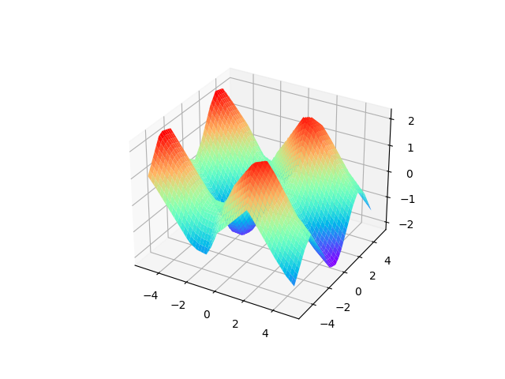

# Neural Network Project One

Using Multi layer classifier to fit non-linear models.

## Requirements

* Linux / Windows
* python 3.7+
* Numpy
* matplotlib 3.3.2

## Install

```bash
# for development
python setup.py develop

# for deploy
python setup.py install
```

## Usage

For more details about arguments, you can refer to `parse_args` in [main.py](main.py).

A simple command to run the step is shown as below.

```shell
python main.py 10000 --verbose --seed 0 --draw
```

## Results

<div align="center">
<br>
<font size=4>prediction before training</font><br>
<br>
<font face=4>Loss during training</font><br>
<br>
<font face=4>prediction after training</font>
</div>

## Docs

[Words](resources/林锦涛_MG20330032_大作业1.docx), [PDF](/resources/林锦涛_MG20330032_大作业1.pdf)

## Features

- Pre-commit with `isort`, `yapf`, `flake8`, `trailing-whitespace`, `markdown`, etc.
- Setup script.

## Development Guide

```bash
# install formatter
pip install yapf

# install pre-commit tool
pip install pre-commit
pre-commit install

# manually check all files
pre-commit run --all-files
```
