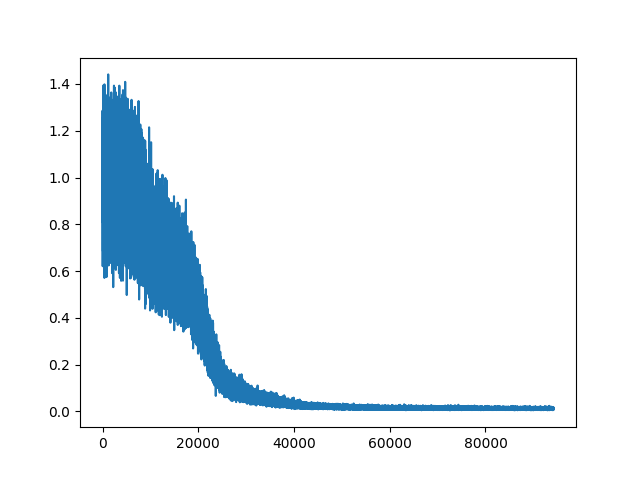

# Neural Network Project One 

Using Multi layer classifier to fit non-linear models.

## Install

```bash
# for development
python setup.py develop

# for deploy
python setup.py install
```

## Usage

For more details about arguments, you can refer to `parse_args` in [main.py](main.py).

A simple command to run the step is shown as below.

```shell
python main.py 10000 --verbose --seed 0 --draw
```

## Results




## Features

- Pre-commit with `isort`, `yapf`, `flake8`, `trailing-whitespace`, `markdown`, etc.
- Setup script.

## Development Guide

```bash
# install formatter
pip install yapf

# install pre-commit tool
pip install pre-commit
pre-commit install

# manually check all files
pre-commit run --all-files
```
